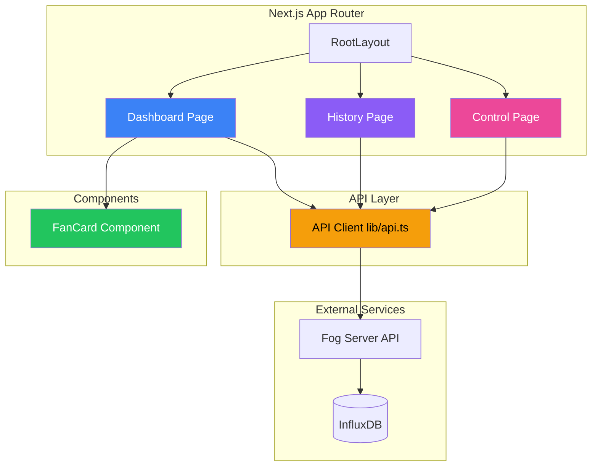
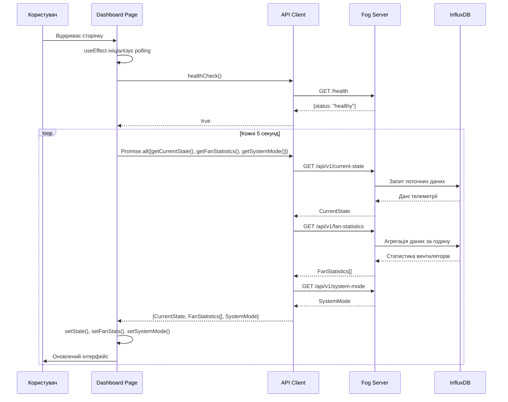
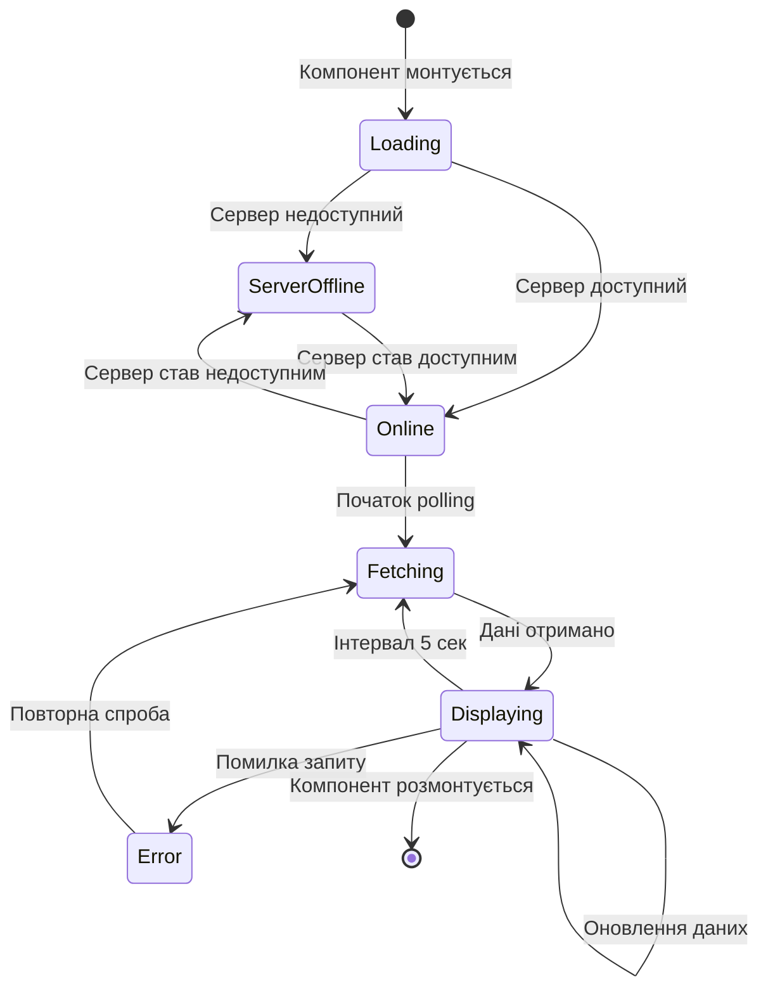
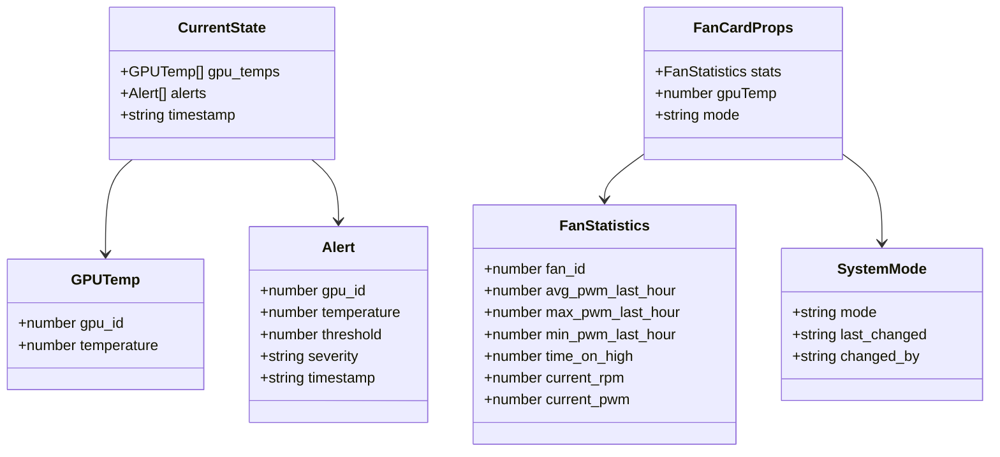

# 5 ПРОЕКТУВАННЯ ІНТЕРФЕЙСУ КОРИСТУВАЧА

У цьому розділі розглядається процес проектування інтерфейсу користувача для веб-системи моніторингу та керування охолодженням GPU-кластера. Проектування інтерфейсу базується на принципах сучасного веб-дизайну, орієнтованого на користувача, та враховує специфіку систем реального часу, де критично важливими є швидкість сприйняття інформації, зручність навігації та інтуїтивність взаємодії. Розробка інтерфейсу здійснювалася з урахуванням сучасних технологій та найкращих практик UX/UI дизайну для систем моніторингу та керування.

## 5.1 Загальна інфраструктура інтерфейсу користувача

Загальна інфраструктура інтерфейсу користувача визначає структуру досвіду користувача загалом, від розташування функціональних елементів на екрані до інтерактивної взаємодії та її організуючих принципів. Для системи моніторингу GPU-кластера обрано архітектуру інтерфейсу, що базується на концепції Dashboard (інформаційної панелі) з підтримкою множинних представлень даних та гнучкої навігації між функціональними модулями.

Архітектура інтерфейсу реалізована на базі фреймворку Next.js з використанням App Router, що забезпечує файлову маршрутизацію та природне розділення функціональності на окремі сторінки. Такий підхід дозволяє створювати логічно структуровані маршрути, де кожна сторінка відповідає за конкретну функціональну область системи. Головна сторінка Dashboard слугує центральним хабом для моніторингу поточного стану системи, тоді як додаткові сторінки забезпечують спеціалізовану функціональність: історія та графіки для аналізу трендів, ручне керування для прямого втручання в роботу системи.

Організація інтерфейсу базується на принципі прогресивного розкриття інформації: на головній сторінці користувач отримує найважливішу інформацію у стислому вигляді (поточні температури, стан вентиляторів, активні алерти), а детальна інформація та історичні дані доступні через навігацію до спеціалізованих сторінок. Такий підхід забезпечує швидкий доступ до критичної інформації при збереженні можливості глибокого аналізу при необхідності.

## 5.2 Візуальна інфраструктура взаємодії

Візуальна інфраструктура взаємодії визначає візуальну мову, яка використовується для представлення даних, концепцій, функціональності та відмінних ознак системи. Проектування візуальної інфраструктури здійснювалося з урахуванням потреб системи моніторингу, де важливими є швидке сприйняття стану системи, візуальна ієрархія інформації та ефективне використання кольорового кодування для передачі значення.

### 5.2.1 Дизайн-система та візуальна мова

Візуальна мова системи побудована на основі принципів мінімалізму та функціональності. Використовується світла колірна схема з білим фоном та сірими відтінками для нейтральних елементів, що забезпечує високу контрастність та читабельність тексту. Кольорове кодування застосовується вибірково для передачі значення та стану: зелений колір позначає нормальний стан, жовтий — попередження, червоний — критичну ситуацію.

Типографічна система базується на шрифтах Geist Sans та Geist Mono, що забезпечують чіткість та читабельність як для заголовків, так і для моноширинного тексту (наприклад, числових значень). Ієрархія типографії реалізована через різні розміри шрифтів та ваги: великі жирні заголовки для основних розділів, середні для підзаголовків, малі для допоміжної інформації. Така ієрархія допомагає користувачу швидко орієнтуватися в інтерфейсі та знаходити потрібну інформацію.

Компонентна архітектура інтерфейсу реалізована через систему карток (cards), що групують логічно пов'язану інформацію. Картки мають білий фон, заокруглені кути та тінь для створення візуального відділення від фону. Кожна картка має чітко визначену структуру: заголовок, основний контент та опціональні дії. Така структура забезпечує консистентність інтерфейсу та спрощує сприйняття інформації.

### 5.2.2 Кольорове кодування та візуальна індикація стану

Кольорове кодування є ключовим елементом візуальної інфраструктури для системи моніторингу, оскільки дозволяє швидко передавати стан системи без необхідності читання числових значень. Система використовує трирівневу шкалу кольорового кодування для температур GPU: зелений колір для нормальних температур (нижче 70°C), жовтий для підвищених (70-90°C) та червоний для критичних (вище 90°C).

Реалізація кольорового кодування здійснюється через умовне застосування CSS-класів на основі значень температур. Наприклад, для карток GPU використовується ліва межа (border-left) різного кольору залежно від температури, що створює миттєву візуальну індикацію стану кожного GPU. Аналогічний підхід застосовується для індикації стану вентиляторів: зелений колір для низького PWM (нижче 40%), жовтий для середнього (40-70%) та червоний для високого (вище 70%).

Для системи алертів використовується додатковий візуальний елемент — іконка трикутника з вигуком (AlertTriangle з бібліотеки lucide-react), що посилює візуальне сприйняття критичної інформації. Критичні алерти відображаються на червоному фоні з чіткою типографією, що забезпечує їх миттєве помічення користувачем.

### 5.2.3 Адаптивність та responsive design

Візуальна інфраструктура реалізована з підтримкою адаптивного дизайну для різних розмірів екранів. Використовується система сітки (grid) з Tailwind CSS, що автоматично адаптується до ширини екрану: на мобільних пристроях картки розташовуються в один стовпець, на планшетах — у два, на десктопах — у чотири. Така адаптивність забезпечує зручне використання системи на різних пристроях без втрати функціональності.

Реалізація адаптивності здійснюється через responsive модифікатори Tailwind CSS (sm:, md:, lg:), що дозволяють задавати різні стилі для різних breakpoints. Наприклад, клас `grid-cols-1 md:grid-cols-2 lg:grid-cols-4` створює сітку з одним стовпцем на мобільних пристроях, двома на планшетах та чотирма на десктопах. Такий підхід забезпечує оптимальне використання простору екрану на будь-якому пристрої.

## 5.3 Фізична інфраструктура взаємодії

Фізична інфраструктура взаємодії визначає організацію інтерактивних елементів та принципи їх взаємодії з користувачем. Для системи моніторингу важливими є швидкість реакції інтерфейсу на дії користувача, зрозумілість інтерактивних елементів та забезпечення безпеки при виконанні критичних операцій.

### 5.3.1 Навігація та маршрутизація

Навігація в системі реалізована через систему гіперпосилань між сторінками, що забезпечує просту та зрозумілу структуру переміщення користувача. Головна сторінка Dashboard містить кнопки навігації до спеціалізованих сторінок: "Історія та графіки" та "Ручне керування". Кожна спеціалізована сторінка має кнопку "Назад до Dashboard" для повернення до головної сторінки.

Реалізація навігації здійснюється через стандартні HTML-посилання (`<a>` теги) зі стилізацією через Tailwind CSS. Посилання мають візуальні індикатори hover-стану (зміна кольору при наведенні) та чіткі іконки для швидкого розпізнавання призначення. Такий підхід забезпечує інтуїтивну навігацію без необхідності вивчення структури системи.

Маршрутизація реалізована через Next.js App Router, де кожна сторінка відповідає файлу в директорії `app/`. Структура маршрутів відображає логічну організацію функціональності: головна сторінка (`/`), сторінка історії (`/history`), сторінка ручного керування (`/control`). Така структура забезпечує зрозумілі URL та спрощує навігацію користувача.

### 5.3.2 Інтерактивні елементи та форми

Інтерактивні елементи інтерфейсу реалізовані з урахуванням принципів доступності та зручності використання. Кнопки мають достатній розмір для зручного натискання, чіткі мітки та візуальну індикацію стану (hover, active, disabled). Використовується консистентна колірна схема для кнопок: синій для основних дій, сірий для допоміжних, червоний для критичних операцій.

На сторінці ручного керування реалізовано систему слайдерів (range inputs) для встановлення PWM вентиляторів. Слайдери мають візуальну індикацію поточного значення, розрахунок відповідних RPM на основі PWM, та попередження при потенційно небезпечних комбінаціях (висока температура GPU з низьким PWM). Така реалізація забезпечує інтуїтивне керування з одночасним забезпеченням безпеки системи.

Форми та інтерактивні елементи мають валідацію на клієнтському рівні перед надсиланням даних на сервер. Наприклад, при застосуванні ручних команд система перевіряє наявність потенційно небезпечних комбінацій та показує діалог підтвердження перед виконанням операції. Така валідація допомагає уникнути помилок користувача та забезпечує безпеку системи.

### 5.3.3 Оновлення даних та реактивність інтерфейсу

Інтерфейс системи реалізує механізм автоматичного оновлення даних через періодичне опитування сервера (polling) з інтервалом 5 секунд. Це забезпечує актуальність інформації без необхідності ручного оновлення сторінки. Реалізація здійснюється через React хук `useEffect` з `setInterval`, що виконує асинхронні запити до API та оновлює стан компонентів.

Реактивність інтерфейсу забезпечується через використання React state management. Кожна сторінка має локальний стан для зберігання даних, що отримуються з API, та автоматично оновлюється при зміні цих даних. Такий підхід забезпечує миттєву реакцію інтерфейсу на зміни стану системи без необхідності повного перезавантаження сторінки.

Для індикації процесу завантаження використовуються стани loading, що показують користувачу, що система обробляє запит. Наприклад, при застосуванні ручних команд кнопка змінює текст на "Застосування..." та стає неактивною, що запобігає повторним натисканням та інформує користувача про процес обробки.

## 5.4 Реалізація головної сторінки Dashboard

Головна сторінка Dashboard є центральним елементом інтерфейсу системи, що забезпечує комплексний огляд стану системи охолодження GPU-кластера. Реалізація сторінки базується на принципах інформаційної архітектури, де найважливіша інформація розташовується на початку сторінки, а детальна інформація структурована за логічними блоками.

### 5.4.1 Структура та організація контенту

Структура Dashboard організована вертикально з чіткою ієрархією інформації. На початку сторінки розташований заголовок з назвою системи та коротким описом, що забезпечує контекст для користувача. Нижче розташований статус-бар, що відображає загальний стан системи, поточний режим роботи (автоматичний або ручний) та timestamp останнього оновлення даних.

Статус-бар реалізований як горизонтальна панель з білим фоном, що містить індикатор стану системи (іконка Activity зеленим кольором), бейдж режиму роботи (синій для автоматичного, фіолетовий для ручного) та час останнього оновлення. Така організація забезпечує швидкий огляд стану системи без необхідності аналізу детальної інформації.

Після статус-бара розташована система алертів, що динамічно відображає критичні та попереджувальні повідомлення про температури GPU. Алерти реалізовані як картки з кольоровою лівою межею (червона для критичних, жовта для попереджень) та іконкою трикутника з вигуком. Кожен алерт містить інформацію про GPU, температуру та порогове значення, що дозволяє користувачу швидко оцінити ситуацію.

### 5.4.2 Візуалізація температур GPU

Температури GPU відображаються у вигляді сітки карток, де кожна картка представляє один GPU. Картки організовані в адаптивну сітку, що автоматично підлаштовується під розмір екрану. Кожна картка містить ідентифікатор GPU, поточну температуру великим шрифтом, іконку термометра з кольоровим кодуванням та інформацію про режим керування вентилятором.

Реалізація карток GPU здійснюється через мапінг масиву температур з умовною стилізацією на основі значень. Температури нижче 70°C мають зелену ліву межу та зелену іконку, температури від 70°C до 90°C — жовту, температури вище 90°C — червону. Така візуальна індикація дозволяє користувачу миттєво оцінити стан кожного GPU без необхідності читання числових значень.

Кожна картка GPU також містить інформацію про режим керування вентилятором (автоматичний або ручний), що забезпечує контекст для розуміння причин поточного стану. Іконка вентилятора з текстовою міткою допомагає користувачу швидко зрозуміти, чи працює система в автоматичному режимі чи під ручним керуванням.

### 5.4.3 Візуалізація стану вентиляторів

Стан вентиляторів відображається через інтеграцію компонента `FanCard`, що інкапсулює логіку відображення детальної інформації про кожен вентилятор. Компонент отримує статистику вентилятора, температуру відповідного GPU та режим роботи системи як пропси, що забезпечує гнучкість та переіспользуваність.

Компонент `FanCard` реалізує комплексну візуалізацію стану вентилятора, включаючи поточні значення PWM та RPM, візуальний прогрес-бар з кольоровим кодуванням, статистику за останню годину (середній PWM, час роботи на високих оборотах) та контекстну інформацію про температуру GPU. Така деталізація дозволяє користувачу глибоко аналізувати роботу кожного вентилятора та виявляти потенційні проблеми.

Візуальний прогрес-бар PWM реалізований як горизонтальна смуга з динамічною шириною, що відображає поточне значення PWM у відсотках. Колір смуги змінюється залежно від значення: зелений для низького PWM, жовтий для середнього, червоний для високого. Така візуалізація забезпечує інтуїтивне розуміння навантаження на вентилятор без необхідності аналізу числових значень.

## 5.5 Реалізація сторінки історії та графіків

Сторінка історії та графіків забезпечує візуалізацію динаміки змін температур та роботи вентиляторів у часі, що дозволяє користувачу аналізувати тренди та виявляти закономірності в роботі системи охолодження. Реалізація сторінки базується на бібліотеці Recharts для побудови інтерактивних графіків та обробці часових рядів даних.

### 5.5.1 Обробка та трансформація даних

Дані для графіків отримуються з API fog-сервера у вигляді масиву точок даних з InfluxDB, де кожна точка містить час, тип вимірювання (температура GPU, температура приміщення, PWM вентилятора, RPM вентилятора), ідентифікатор GPU або вентилятора та значення. Для відображення на графіках ці дані необхідно трансформувати у структуру, сумісну з форматом Recharts.

Трансформація даних здійснюється через функцію групування, що перетворює масив точок даних у об'єкт, де ключем є час (відформатований у формат "година:хвилина"), а значенням — об'єкт з температурами всіх GPU та температурою приміщення. Така структура дозволяє Recharts побудувати графік, де кожна точка на осі X відповідає моменту часу, а на осі Y — значенням температур для різних GPU.

Реалізація групування виконується через метод `reduce` масиву JavaScript, що дозволяє ефективно обробити великі обсяги даних. Для кожного GPU створюється окрема лінія на графіку з унікальним кольором, що забезпечує легке розрізнення температур різних GPU. Температура приміщення відображається пунктирною чорною лінією для візуального відділення від температур GPU.

### 5.5.2 Візуалізація температур GPU

Графік температур GPU реалізований як лінійний графік з використанням компонента `LineChart` з бібліотеки Recharts. Графік відображає температури всіх восьми GPU та температуру приміщення на одному графіку, що дозволяє користувачу аналізувати кореляцію між температурами різних GPU та вплив температури приміщення на систему охолодження.

Кожен GPU має унікальний колір з попередньо визначеної палітри, що забезпечує консистентність візуалізації та легке розпізнавання. Кольори обрані з урахуванням контрастності та розрізнення, що дозволяє чітко розрізняти лінії навіть при їх перетині. Температура приміщення відображається пунктирною чорною лінією з товщиною 3 пікселі, що забезпечує її помітність на тлі кольорових ліній GPU.

Графік включає інтерактивні елементи: сітку для легкого читання значень, підказки (tooltips) при наведенні курсора на точки, легенду для ідентифікації ліній. Ось X відображає час у форматі "година:хвилина", а вісь Y — температуру в градусах Цельсія з діапазоном від 20°C до 100°C. Така конфігурація забезпечує оптимальне використання простору графіку та чітке відображення змін температур.

### 5.5.3 Візуалізація роботи вентиляторів

Графік роботи вентиляторів реалізує перемикання між двома режимами відображення: PWM (потужність у відсотках) та RPM (оберти на хвилину). Перемикання здійснюється через кнопки в інтерфейсі, що змінюють стан компонента та відображають відповідний графік. Такий підхід дозволяє користувачу аналізувати роботу вентиляторів з різних перспектив без перезавантаження сторінки.

Графік PWM використовує ступінчастий тип лінії (`type="stepAfter"`), що відображає дискретні зміни керуючих команд. Така візуалізація точно відображає характер роботи системи керування, де команди змінюються дискретно, а не плавно. Графік RPM також використовує ступінчасту лінію, що відображає фактичні оберти вентиляторів у відповідь на зміни PWM.

Кожен вентилятор має унікальний колір з окремої палітри, що відрізняється від палітри GPU для візуального розділення. Легенда графіку включає візуальні індикатори кольорів для кожного вентилятора, що дозволяє легко ідентифікувати лінії на графіку. Діапазон осі Y для PWM становить від 0% до 100%, для RPM — від 500 до 5500 обертів на хвилину.

### 5.5.4 Вибір періоду відображення

Сторінка історії реалізує вибір періоду відображення даних через кнопки: 1 година, 3 години, 6 годин, 24 години. При зміні періоду автоматично виконується новий запит до API з оновленням даних та перебудовою графіків. Така функціональність дозволяє користувачу аналізувати як короткострокові зміни (остання година), так і довгострокові тренди (остання доба).

Реалізація вибору періоду здійснюється через React state, що зберігає поточне значення періоду. При зміні значення спрацьовує `useEffect` хук, що виконує новий запит до API з оновленим параметром `hours`. Отримані дані обробляються та трансформуються для відображення на графіках, що забезпечує актуальність візуалізації.

## 5.6 Реалізація сторінки ручного керування

Сторінка ручного керування забезпечує інтерфейс для прямого втручання користувача в роботу системи охолодження, що дозволяє тестувати систему, діагностувати проблеми та застосовувати спеціальні режими роботи. Реалізація сторінки базується на принципах безпеки та валідації, що запобігають небезпечним діям користувача.

### 5.6.1 Перемикання режимів роботи

Сторінка ручного керування починається з перемикача режимів роботи системи, що дозволяє користувачу переключатися між автоматичним та ручним режимами. Перемикач реалізований як дві великі кнопки з візуальною індикацією активного режиму: активна кнопка має кольоровий фон (синій для автоматичного, фіолетовий для ручного), неактивна — сірий фон.

При перемиканні на автоматичний режим система відразу застосовує зміну через API запит, що змінює глобальний режим роботи на fog-сервері. Після успішного перемикання відображається інформаційне повідомлення з підтвердженням зміни. При перемиканні на ручний режим відображається попередження про необхідність контролю за температурами GPU, що нагадує користувачу про відповідальність за безпеку системи.

Реалізація перемикання режимів здійснюється через асинхронну функцію `handleModeSwitch`, що виконує POST-запит до API `/api/v1/system-mode` з новим режимом. Після успішного запиту локальний стан компонента оновлюється, що призводить до перерендеру інтерфейсу з оновленою індикацією режиму. У випадку помилки користувачу показується повідомлення про помилку з описом проблеми.

### 5.6.2 Попередньо встановлені профілі

Для швидкого застосування стандартних налаштувань реалізовано систему попередньо встановлених профілів: "Тихий режим" (25% PWM), "Збалансований" (50% PWM), "Максимум" (100% PWM). Профілі представлені як картки з іконками, назвами та описом значення PWM, що дозволяє користувачу швидко зрозуміти призначення кожного профілю.

При натисканні на профіль автоматично встановлюються відповідні значення PWM для всіх восьми вентиляторів одночасно. Це забезпечує швидке застосування стандартних налаштувань без необхідності ручного налаштування кожного вентилятора окремо. Профілі особливо корисні для тестування системи та застосування спеціальних режимів роботи (наприклад, нічний режим з мінімальним шумом).

Реалізація профілів здійснюється через функцію `applyProfile`, що приймає назву профілю та оновлює стан `fanPWM` для всіх вентиляторів відповідними значеннями. Функція використовує об'єкт з мапінгом профілів на значення PWM, що забезпечує легке додавання нових профілів у майбутньому.

### 5.6.3 Налаштування PWM вентиляторів

Для детального налаштування кожного вентилятора окремо реалізовано систему слайдерів (range inputs), що дозволяють встановлювати PWM у діапазоні від 0% до 100%. Кожен слайдер розташований у власній картці з інформацією про вентилятор, поточну температуру відповідного GPU, поточне значення PWM та розраховане значення RPM.

Слайдери мають візуальну індикацію поточного значення та автоматичний розрахунок RPM на основі PWM за формулою: `RPM = 800 + (5000 - 800) * PWM / 100`. Це дозволяє користувачу бачити очікувані оберти вентилятора при зміні PWM без необхідності застосування команд. Така інтерактивність забезпечує інтуїтивне розуміння впливу змін PWM на роботу вентилятора.

При наявності потенційно небезпечної комбінації (температура GPU вище 70°C з PWM нижче 60%) відображається попередження безпосередньо в картці вентилятора. Попередження має жовтий фон та іконку трикутника, що привертає увагу користувача до потенційної проблеми. Така реалізація допомагає уникнути помилок при налаштуванні та забезпечує безпеку системи.

### 5.6.4 Валідація та застосування команд

Перед застосуванням ручних команд система виконує комплексну валідацію для виявлення потенційно небезпечних комбінацій. Валідація перевіряє кожен вентилятор на наявність високої температури GPU (вище 70°C) з низьким PWM (нижче 60%). Якщо виявлено такі комбінації, користувачу показується діалог підтвердження з переліком попереджень та можливістю скасувати операцію.

Реалізація валідації здійснюється через функцію `handleApplyManualControl`, що перед надсиланням команд виконує цикл перевірки всіх вентиляторів. Виявлені попередження збираються в масив, який відображається в діалозі підтвердження. Користувач може або підтвердити операцію з усвідомленням ризиків, або скасувати та виправити налаштування.

Після успішного застосування команд система оновлює історію дій користувача, що дозволяє відстежувати зміни та діагностувати проблеми. Історія дій відображається в нижній частині сторінки у вигляді списку з timestamp, описом дії та деталями операції. Така функціональність забезпечує прозорість дій користувача та спрощує діагностику системи.

## 5.7 Компонентна архітектура інтерфейсу

Компонентна архітектура інтерфейсу базується на принципах переіспользуваності, інкапсуляції та розділення відповідальності. Використання React компонентів дозволяє створювати модульну структуру інтерфейсу, де кожен компонент відповідає за конкретну функціональність та може бути легко тестований та підтримуваний.

### 5.7.1 Компонент FanCard

Компонент `FanCard` є ключовим елементом компонентної архітектури, що інкапсулює логіку відображення детальної інформації про вентилятор. Компонент реалізований як функціональний React компонент з TypeScript типізацією, що забезпечує типобезпеку та автодоповнення при використанні.

Компонент приймає три пропси: `stats` (статистика вентилятора типу `FanStatistics`), `gpuTemp` (температура відповідного GPU) та `mode` (режим роботи системи). Така структура пропсів забезпечує гнучкість компонента та дозволяє використовувати його в різних контекстах без зміни внутрішньої логіки.

Внутрішня логіка компонента включає функції для визначення кольору стану на основі PWM (`getStatusColor`), текстового опису стану (`getStatusText`) та форматування часу (`formatTime`). Ці функції інкапсульовані всередині компонента, що забезпечує модульність та спрощує підтримку коду.

Візуальна реалізація компонента включає заголовок з іконкою вентилятора та індикацією режиму роботи, інформацію про температуру GPU, візуальний прогрес-бар PWM з кольоровим кодуванням, поточні значення RPM та PWM, та статистику за останню годину. Така комплексна візуалізація забезпечує повну інформацію про стан вентилятора в компактному форматі.

### 5.7.2 Структура сторінок та layout

Структура сторінок реалізована через систему layout компонентів Next.js, де кореневий `layout.tsx` визначає загальну структуру всіх сторінок. Layout включає налаштування шрифтів (Geist Sans та Geist Mono), глобальні стилі та структуру HTML документа з підтримкою української мови.

Кожна сторінка реалізована як клієнтський компонент (з директивою `'use client'`), що дозволяє використовувати React хуки для управління станом та взаємодії з користувачем. Сторінки мають консистентну структуру: заголовок, основний контент у контейнері з максимальною шириною, навігація для повернення до Dashboard (на спеціалізованих сторінках).

Стилізація сторінок здійснюється через Tailwind CSS з використанням utility-класів для консистентного дизайну. Всі сторінки використовують однакову колірну схему, типографію та spacing, що забезпечує візуальну консистентність інтерфейсу та спрощує навігацію користувача.

## 5.8 UML діаграми для візуалізації архітектури інтерфейсу

Для наочної демонстрації архітектури інтерфейсу та взаємодії компонентів використовуються UML діаграми, що відображають структуру компонентів, потоки даних та взаємодію між елементами системи.

### 5.8.1 Діаграма компонентів інтерфейсу

Діаграма компонентів відображає структуру React компонентів та їх взаємозв'язки. Діаграма демонструє, як сторінки (Dashboard, History, Control) використовують спільні компоненти (FanCard) та API-клієнт для отримання даних.

### 5.8.2 Діаграма послідовності оновлення даних

Діаграма послідовності демонструє процес оновлення даних на головній сторінці Dashboard, включаючи polling механізм та обробку відповідей від API.

### 5.8.3 Діаграма станів компонента Dashboard

Діаграма станів відображає різні стани компонента Dashboard та переходи між ними в залежності від дій користувача та отриманих даних.

### 5.8.4 Діаграма класів компонентів

Діаграма класів демонструє структуру TypeScript інтерфейсів та типів, що використовуються в компонентах для забезпечення типобезпеки.

## 5.9 Висновки

Проектування інтерфейсу користувача для веб-системи моніторингу та керування охолодженням GPU-кластера здійснено з урахуванням сучасних принципів UX/UI дизайну та специфіки систем реального часу. Реалізована архітектура інтерфейсу забезпечує швидкий доступ до критичної інформації, зручну навігацію між функціональними модулями та інтуїтивну взаємодію з системою.

Візуальна інфраструктура побудована на принципах мінімалізму та функціональності, з ефективним використанням кольорового кодування для передачі стану системи. Компонентна архітектура забезпечує модульність та переіспользуваність коду, що спрощує підтримку та розширення функціональності.

Реалізація сторінок базується на принципах інформаційної архітектури, де найважливіша інформація розташовується на початку, а детальна інформація доступна через навігацію. Механізм автоматичного оновлення даних забезпечує актуальність інформації без необхідності ручного оновлення сторінки.

Система валідації та безпеки на сторінці ручного керування запобігає небезпечним діям користувача та забезпечує контроль за станом системи. Візуалізація даних через інтерактивні графіки дозволяє користувачу аналізувати тренди та виявляти закономірності в роботі системи охолодження.

Загальна інфраструктура інтерфейсу забезпечує цілісний та послідовний досвід користувача, де кожен елемент інтерфейсу має чітке призначення та сприяє ефективному використанню системи. Реалізація інтерфейсу на базі сучасних технологій (Next.js, React, TypeScript, Tailwind CSS) забезпечує високу продуктивність, типобезпеку та легкість підтримки коду.

